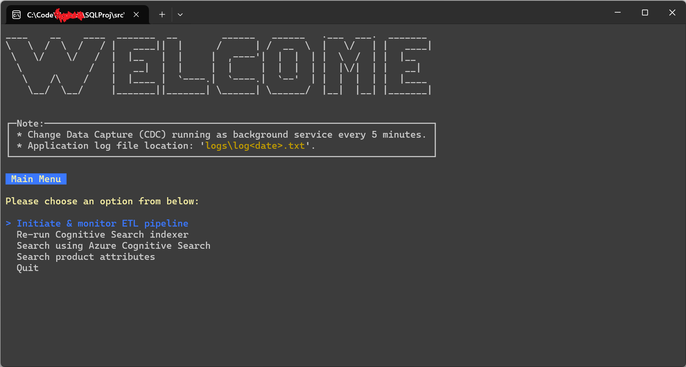
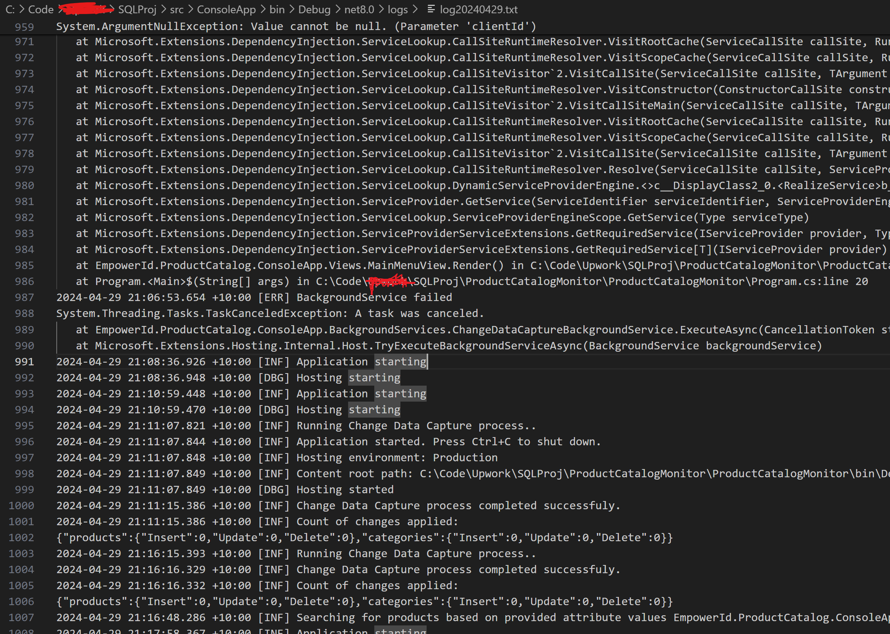

# Product Catalog Management Application
A .NET 8.0 based Console Application that allows initiating and monitoring ETL pipelines, 
search product catalog, and capture data changes to push to an external database.

Special attention has been paid to get the code concise and nicely structured and to beautify the 
console based user interface. Developer has gone the extra mile by incorporating concepts like dependency injection, and configuration management.

## Table Of Contents

1. [Features](#features)
2. [Related Artifacts](#related-artifacts)
3. [Build](#build)

## Features
* Beautiful user interface.
* Initiate Azure Data Factory pipeline and monitor status.
* Run Azure Cognitive Search Indexer to bring it up to date with new data.
* Search for products using Azure Cognitive Search across all attributes.
* Search for products by specifying individual product attribute filters.
* A background service to synchronise product data with an external 
  database leveraging Change Data Capture (CDC).
* Structured logging of application events in files with rolling interval.

Application's Main Menu:

Example log file. PS: Don't be alarmed by the exception shown, its fixed :) :

## Related Artifacts
Following artifacts have been set up in the Azure environment under (empowerid-sql-arch-rg) resource group:

* An Azure SQL database (empowerid-sqlsrv/ProductCatalog) with Products, Categories, Orders, and 
  OrderLineItems tables. CDC has been enabled on the database, and products and categories table
  are included in the CDC. A View is also created (ProductWithCategories) to allow easy indexing
  of product data through Cognitive Search.
* An Azure Data Factory instance (empowerid-adf) with a data pipeline named "ProductDataPipeline" that
  extracts data from a csv file stored in blob storage, transforms, and loads into the sql database.
* An Azure AI Search (aka Cognitive Search) setup that indexes product data from the sql database 
  for easy searching.

## Build

### Pre-requisites:
* .NET 8 SDK
* Sql Server Management Studio (SSMS) / Azure Data Studio

If building, running, debugging through Visual Studio:

* Visual Studio 2022 (with .NET 8.0)
* SQL Server Data Tools for Visual Studio (SSDT)

### dotnet cli:
* Open command terminal.
* Navigate to the project folder.
* Navigate to `src\`.
* Open `ConsoleApp\appsettings.json` file in your editor of choice and
  add the necessary credentials in the placeholders
  (Or ask 'someone who knows' to provide you with a copy of working appsettings file).
* In the terminal window, run the following commands:
    - `dotnet restore`
    - `dotnet build`
    - and then finally:
      `dotnet run`
* Find application log file in the bin folder (`src\ConsoleApp\bin\Debug\net8.0\logs\log<date>.txt`) 
  to troubleshoot any errors.

### Visual Studio:
* Clone the repository on local computer.
* Open the solution file (`src/ProductCatalog.sln`) in Visual Studio.
* Provide the necessary credentials in `src\ConsoleApp\appsettings.json` file 
  (Or ask 'someone who knows' to provide you with a copy of working appsettings file).
* Ensure that `EmpowerId.ProductCatalog.ConsoleApp` project is Set as Startup Project.
* Build & Run the project through Visual Studio the usual way.
* Find application log file in the bin folder (`src\ConsoleApp\bin\Debug\net8.0\logs\log<date>.txt`) 
  to troubleshoot any errors.

## CI/CD Setup
* To be done later.

